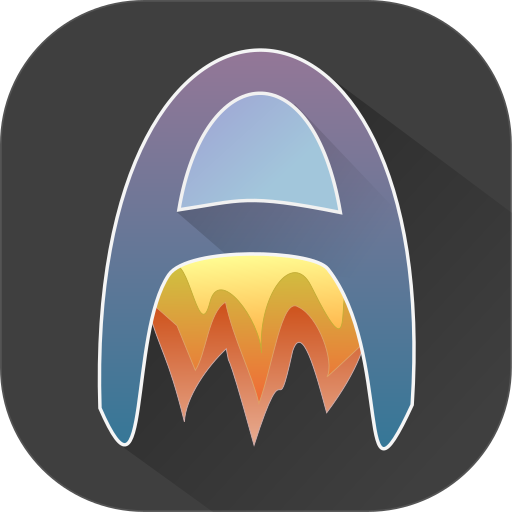

# Audinaut
⚠ No longer maintained. 

Although not a direct replacement, I've since moved onto syncing an Opus version
of my entire library to my phone using [harmonize](https://github.com/nvllsvm/harmonize)
and [Syncthing](https://syncthing.net/).

--- 

A Subsonic client for Android.

